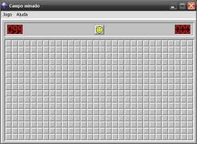

# Projeto campo-minado
###Ex:

## Descrição do Projeto

O projeto Possui um tabuleiro
que é composte por linhas e colunas, ciando pequenos quadrados,
  e o clicar nos quadrados o usuário poderá conseguir uma
pontuação ou perder o jogo ao pisar em uma mina.

<h4 align="center"> 
	🚧  Java 🚀 Em construção...  🚧
</h4>

